# **Sistema de Autocompletar e Sugestões de Palavras**

Atividade para a disciplina de Algoritmos e Estruturas de Dados II. <br/>

## 🎯Objetivo 

Neste trabalho, o objetivo é criar um sistema que possibilite a funcionalidade de autocompletar e oferecer sugestões de palavras aos usuários. Nessa implementação é utilizado uma estrutura da árvore binária como base. Além disso, foi desenvolvido a árvore AVL e o algoritmo de Huffman para fins comparativos de execução.
O objetivo é estabelecer uma relação entre as palavras dos textos de acordo com suas ocorrências e as palavras de pesquisa.

## 🗂️Estrutura 

- ```document.hpp:``` Apresenta a struct ```WordInfo``` e ```AVL```inclusão das bibliotecas usadas.
- ```document.cpp:``` Desenvolvimento das funções de leitura dos arquivos e construção do heap e do arquivo output.    
- ```document.hpp:``` Apresenta a struct ```No``` e ```Huffman```.
- ```document.cpp:``` Desenvolvimento das funções da árvore binária, da AVL e do algoritmo de Huffman.  
- ```main.cpp:``` Chamada das funções usadas e o tempo de execução do programa.
- ```input.txt:``` Palavras de busca. 
- ```stopwords.txt:``` Artigos e conjunções como (a, o, as, os, e, ou).
- ```output.txt``` Arquivo de saída. 
- Outros arquivos contidos dentro da pasta ```data```se referem aos textos de entrada.

## 💻Resumo

A abordagem consistirá em três etapas diferentes:

1. **Árvore Binária Padrão**: Será implementado uma árvore binária tradicional, selecionando as palavras mais relevantes e relacionadas à pesquisa em cada texto. 
A relevância de uma palavra será determinada por sua frequência e proximidade à palavra de pesquisa.
2. **Árvore AVL**: Será implementado uma árvore AVL e repetiremos o processo de análise.
3. **Codificação de Huffman**: Será implementado o código de Huffman para otimizar a árvore binária padrão. Será calculado códigos para cada palavra que posteriormente serão organizadas na
estrutura da árvore com base nesses códigos.

## ✔️Diretrizes 

As especificações a seguir foram propostas para discussão do problema:

- Os textos de entrada são lidos independente do nome e os nomes são armazenados em uma ```list<string>nameFiles```.
- As palavras do arquivo ```ìnput``` são lidas e armazenadas em uma ```list<string>wordInput```.
- O conteúdo do arquivo de ```stopwords```, pode ser alterado de acordo com a preferência do usuário, desde que cada palavra esteja em uma linha do arquivo. 
- As stop words que forem encontradas em cada texto, são em seguida excluídas dele. Pois, por serem artigos e conjunções facilmente seriam as mais frequentes do heap, no entanto foram desconsideradas.
- O nome do arquivo ```stopwords.txt``` não deve ser alterado.

- Inicialmente o algoritmo percorre a lista com o nome dos arquivos, e para cada texto que é aberto, os seguintes procedimentos ocorrem:

- O algoritmo realiza a leitura dele e cria uma tabela de dispersão (hash) intitulada ```glossary```, para contar quantas vezes cada palavra aparece no texto. A chave do hash é a própria palavra e o valor são as ocorrências, armazenadas em uma struct denominada ```WordInfo```.

- Em seguida, a partir de um valor K, é inserido em um vetor intitulado ```heap``` as primeiras K palavras guardadas no hash e depois são organizadas de forma que a menor ocorrência das K palavras inseridas, esteja na primeira posição do vetor.
- Após isso para cada elemento restante no hash, é realizado comparações com o menor valor contido no heap, esses valores são as ocorrências:

  1. Se a ocorrência for maior do que o menor valor da heap, o menor valor é removido, o novo elemento é inserido e a estrutura novamente organizada.
  2. Caso contrário, o elemento deve ser ignorado, e é comparado o próximo dado até o fim do glossário.
- No final, a heap conterá os K elementos com maiores valores (ocorrências) dentre os textos lidos. 

- Após isso, outro looping inicia para a lista de palavras a serem buscadas, para cada palavra do input os seguintes procedimentos ocorrem:
  1. É verificado se a palavra está no texto, se não estiver ela é ignorada e é processado a próxima palavra. Se estiver, o próximo comando será:

  2. É verificado se a palavra está no heap, se sim, ela é retirada dele. Se não, o menos elemento do heap é tirado.
  3. É criada a árvore binária.
  4. É criada a árvore AVL.
  5. É criada a árvore a partir do código de Huffman.

As árvores criadas terão a mesma quantidade de elementos que o valor de ```K```e cada nó é uma posição do heap, com palavra e ocorrência.

- Depois desses passos, o glossário é limpado e todas as árvores e o heap são excluídos.
- Em seguida, é processado o próximo texto, repetindo o mesmo procedimento até que todos sejam lidos.
- Quando todos forem lidos, o algoritmo finaliza o output e encerra o programa.

De modo geral, para cada texto é buscado uma lista de palavras e para cada uma presente no texto, ela terá 3 tipos de estruturas em árvore.

- Os textos de entrada são lidos caracter por caracter, e utiliza-se um switch case para identificar o início e o fim das palavras.
- As palavras que contém hífen, tiveram o hífen removido. Por exemplo "arco-íris" passa a ser "arcoíris".
- O valor da variável ```K```pode ser alterado, porém sempre deve ser um valor com uma unidade a mais do que se deseja mostrar
  exemplo: Para um heap de tamanho 20, o valor de K deverá ser 21.
- 

## 📝Decisões de implementação  

### heap
O algoritmo implementa uma min-heap, ou seja, cada nó tem um valor menor ou igual ao valor de seus filhos, mantendo o menor elemento na primeira posição. Os valores a serem armazenados nessa estrutura são as maiores ocorrências de palavras no texto. Dessa forma. é coletado as K palavras com maiores ocorrências. Cada texto irá ter um heap.

Custo Computacional: <br>
$O$  $n(log$ $k)$, onde $n$ é o tamanho da coleção de dados e $k$ o número de itens mais relevantes.
<br>

### Árvore Binária

Uma árvore binária é uma estrutura de dados hierárquica composta por nós, em que cada nó pode ter, no máximo, dois filhos: um filho à esquerda e um filho à direita. Quando a árvore está vazia, o valor da raiz é NULL. Cada nó de uma árvore binária consiste em três partes:

1. Dados: Armazena as informações associadas ao nó, nessa caso uma struct ```WordInfo```com a palavra e a ocorrência.
1. Ponteiro para o filho esquerdo.
1. Ponteiro para o filho direito.

Propriedades de uma árvore:

- Nó: Cada elemento em uma árvore binária é chamado de "nó" que contém um dado, e pode ter até dois filhos.
- Raiz: O nó superior de uma árvore binária é chamado de "raiz". É o ponto de partida da árvore.
- Filho: Cada nó em uma árvore binária pode ter no máximo dois filhos, que são outros nós que descendem dele.
- Pai: Cada nó, exceto a raiz, tem um nó pai, que é o nó do qual ele é descendente direto.
- Folha: Os nós que não têm filhos são chamados de "folhas". São os nós terminais da árvore.
- Subárvore: Uma subárvore é uma árvore binária que faz parte de uma árvore maior. Por exemplo, a subárvore enraizada em um nó filho é uma árvore por si só.
- Altura: A altura de uma árvore é o comprimento do caminho mais longo da raiz até uma de suas folhas. É uma medida da profundidade da árvore.

- A regra básica para inserção é: Dado um nó qualquer, se o valor a ser inserido for menor ou igual ao nó, o item irá para a esquerda e se for um valor maior que o nó o item vai para direita.

Custo Computacional: $O$ $(n)$
#### Exemplo da inserção deste método 
<br>

<div style="display: flex; justify-content: center;">
    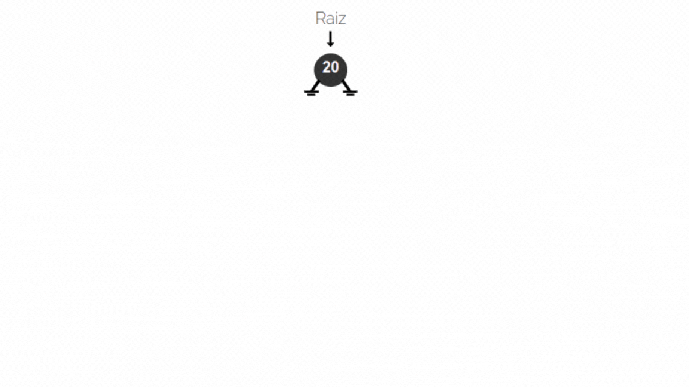
</div>

### AVL

A árvore AVL é uma árvore de pesquisa binária balanceada. As diferenças entre as alturas das subárvores esquerda e direita para cada nó são menores ou iguais a 1.
Esse equilíbrio é mantido por meio de ```rotações```, podendo elas serem simples ou duplas.<br>
Para cada nó é calculado a distância dele até seu último nó (folha). Para o lado direito é recebido valores positivos e para o lado esquerdo os negativos. O sinal da diferença entre os valores indica para qual lado a árvore está desequilibrada e deve girar.

Se o sinal do nó pai, com o nó filho, ambos forem positivos, a rotação ocorre para ```direita```
Se o sinal do nó pai, com o nó filho, ambos forem negativos, a rotação ocorre para ```esquerda```
Se o sinal do nó pai, com o nó filho, forem diferentes, ocorre uma ```rotação dupla``` que pode ser ```rotação dupla para direita``` e ```rotação dupla para esquerda``` ou o contrário.

Sua estrutura contém o dado, ponteiros para esquerda e direita assim como na estrutura anterior, com o acrécimo de uma váriavel ```altura```em cada nó.

Custo Computacional:
A maioria das operações do BST (por exemplo, pesquisar, inserir, excluir, etc.) leva tempo $O(h)$, onde $h$ é a altura do BST. O custo dessas operações pode se tornar $O(n)$ para uma árvore binária distorcida. Se nos certificarmos de que a altura da árvore permanece $O$ $log(n)$ após cada inserção e exclusão, então podemos garantir um limite superior de $O$ $log(n)$ para todas essas operações. A altura de uma árvore AVL é sempre $O$$($log$ $(n)$ )$ onde $n$ é o número de nós na árvore.

#### Exemplo da inserção deste método

|           |           |
| --------- | --------- |
| 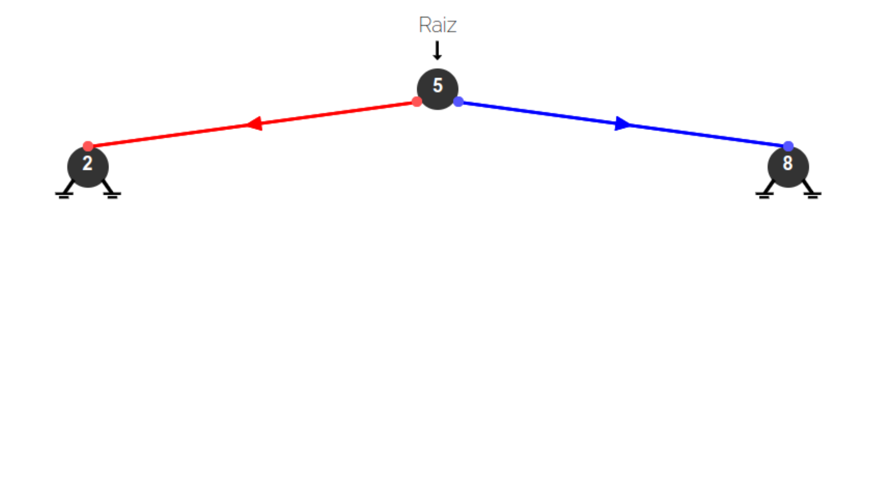 | 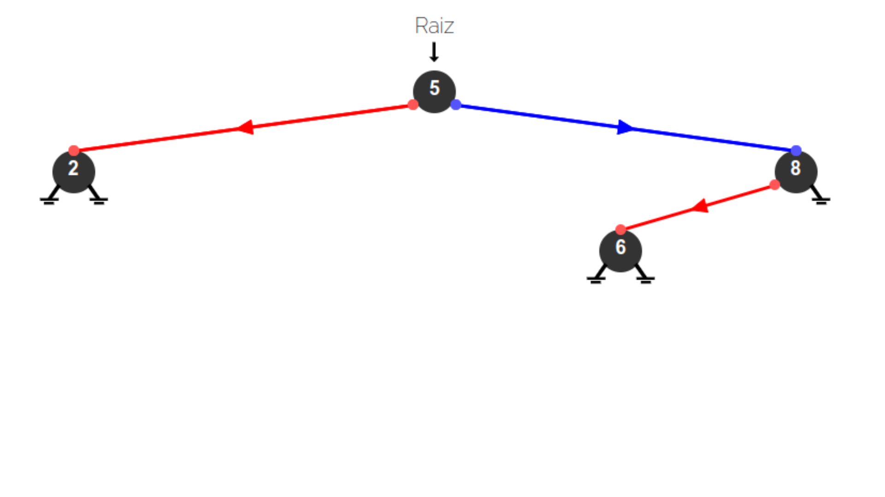 |
|  | 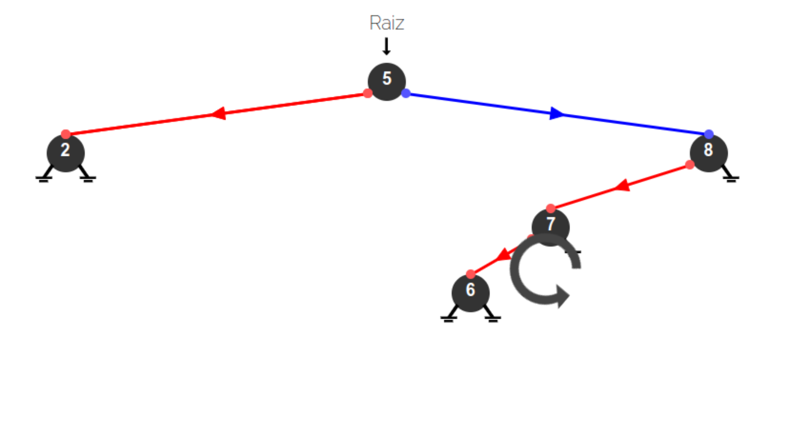 |
| 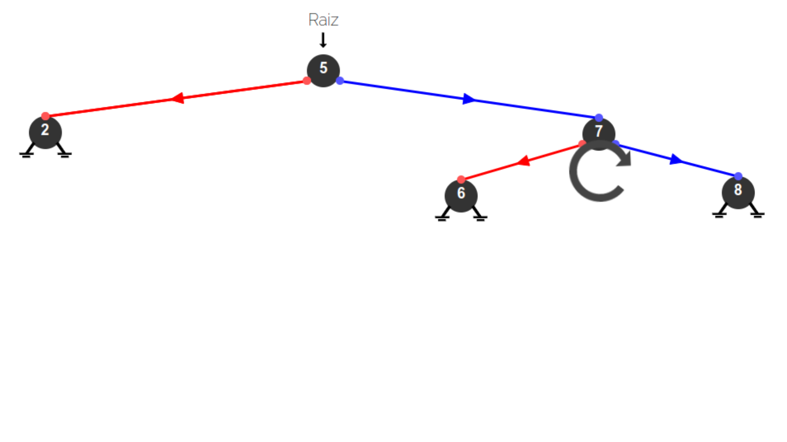 | 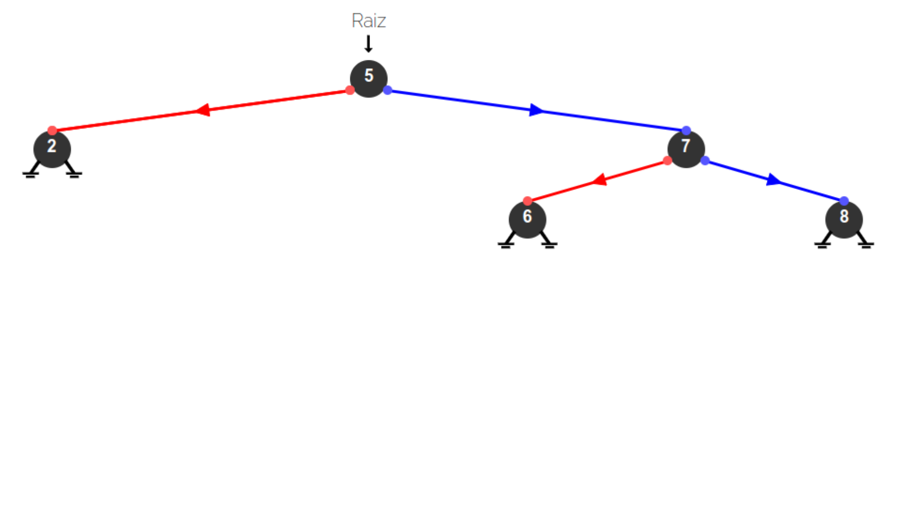 |


### Códificação de Huffman

O algoritmo de codificação de Huffman é um método de compressão de dados que é amplamente utilizado na compactação de informações. É útil para compactar os dados nos quais há caracteres (palavras) que ocorrem com frequência. Foi desenvolvido pela primeira vez por David Huffman.
Dado o heap, a tarefa é encontrar códigos Huffman para cada palavra. Funciona da seguinte maneira:

1. Os dados são organizados em ordem crescente de frequência e armazenados em uma fila de prioridade.
2. Cria-se um nó vazio x. A primeira frequência mínima se torna filho esquerdo de x e a segunda frequência mínima ao filho direito de x. <br>
  O valor de x será a soma das duas frequências mínimas acima.
3. Essas duas ocorrências utilizadas são removidas, e x é adicionada de volta na fila, troca-se dois nós por um único.
4. O processo se repete até que reste apenas um elemento na fila.
5. Por fim, se tem a árvore montada.
6. Para os nós filhos a esquerda é atribuído o valor ```0```.
7. Para os nós filhos a direita é atribuído o valor ```1```.

- Cada palavra terá um código formado por 0 e/ou 1.
- Para decodificar o código, deve-se percorrer a árvore seguindo os bits no código até chegar a uma folha, que corresponde a um elemento do conjunto de dados original.

Complexidade de tempo: $O$ $($ $n*log$ $n$ $)$ onde $n$ é o número de caracteres únicos <br>
Espaço Auxiliar: $O$ $(n)$

A codificação de Huffman leva tempo O (n log (n))
A complexidade de tempo do algoritmo de Huffman é O(nlog(n)) onde n é o número de caracteres no texto. Os pesos na árvore correspondem à frequência de ocorrência do personagem. A abordagem gananciosa coloca os n caracteres em n subárvores e começa combinando os dois nós de menor peso em uma árvore à qual é atribuída a soma dos pesos dos dois nós folha como o peso de seu nó raiz.
Usando um heap para armazenar o peso de cada árvore, cada iteração requer tempo O(log(n)) para determinar o peso mais barato e inserir o novo peso. Existem O(n) iterações, uma para cada item.

#### Exemplo da inserção deste método

|           |           |
| --------- | --------- |
| 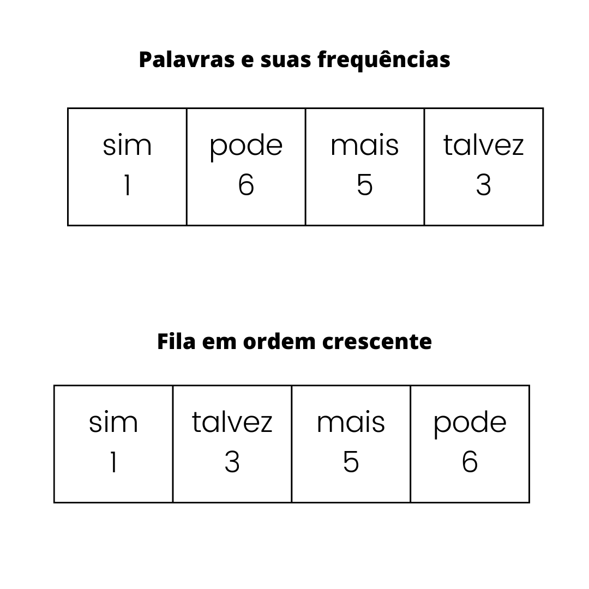 | 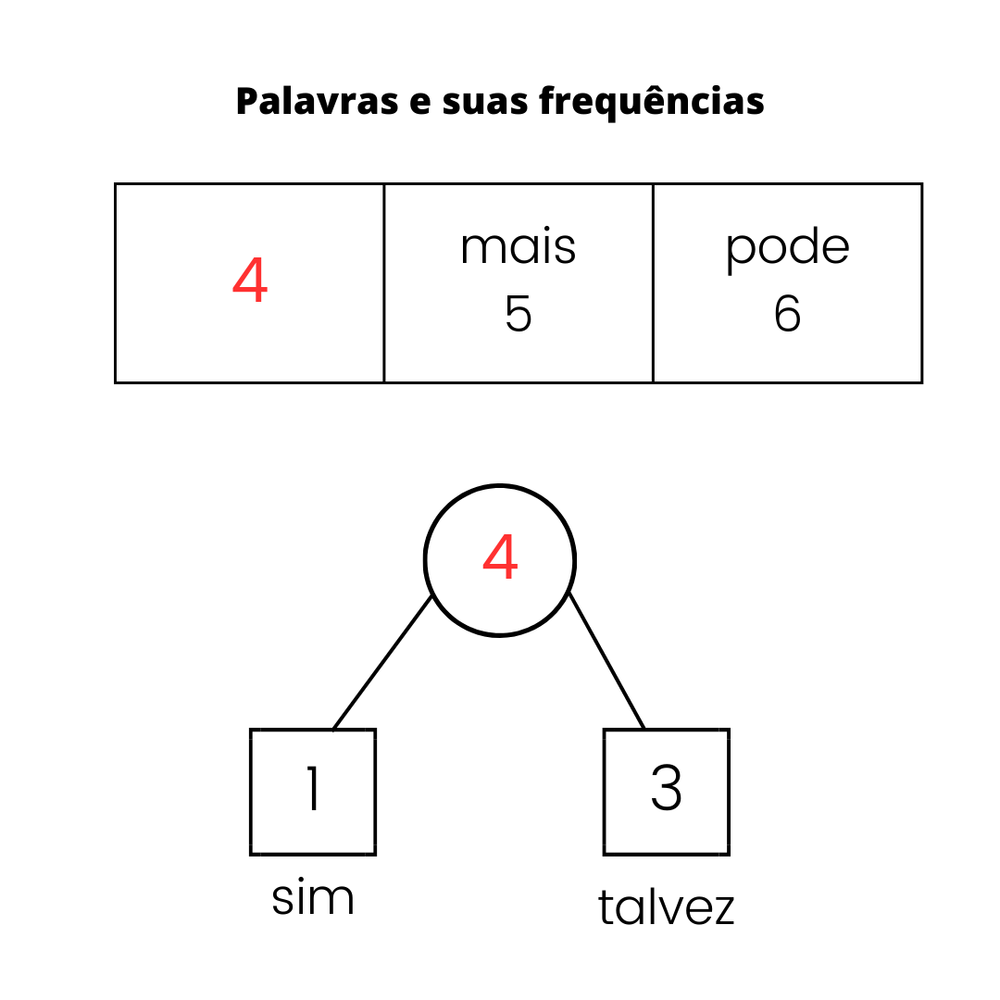 |
| 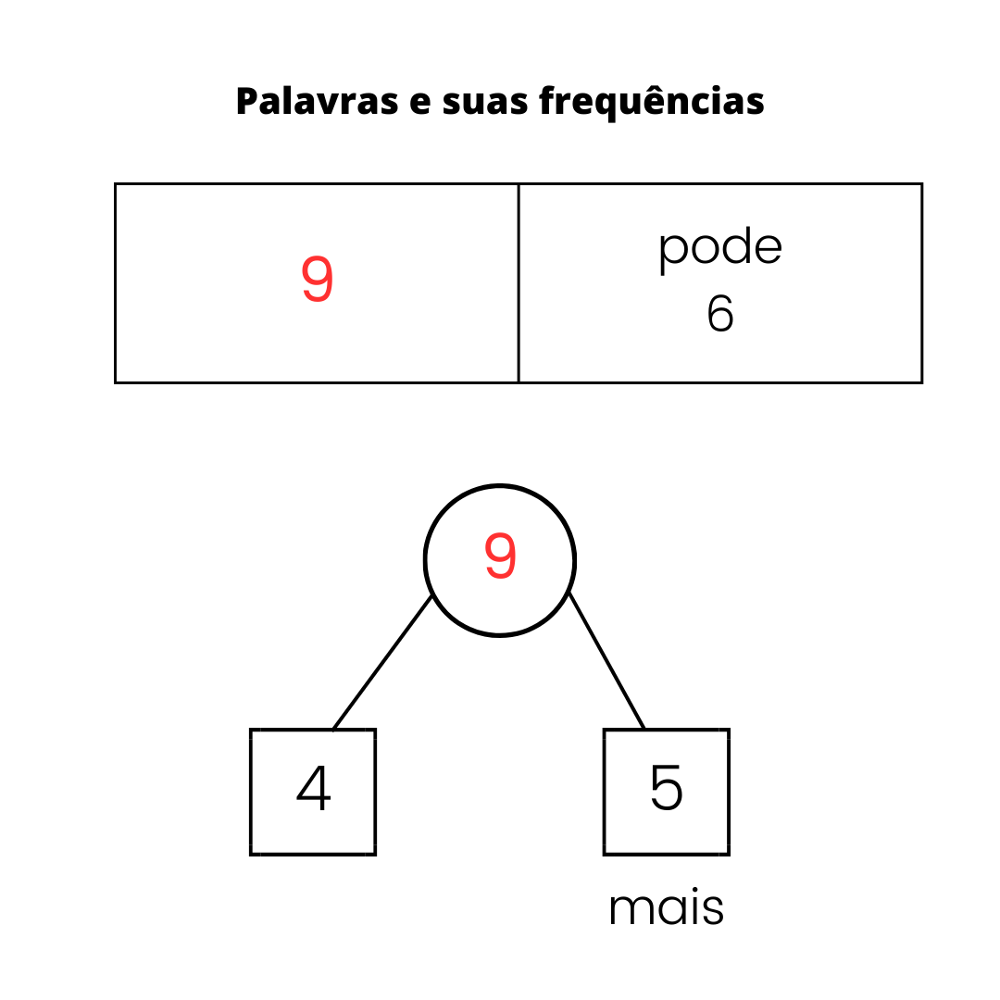 | 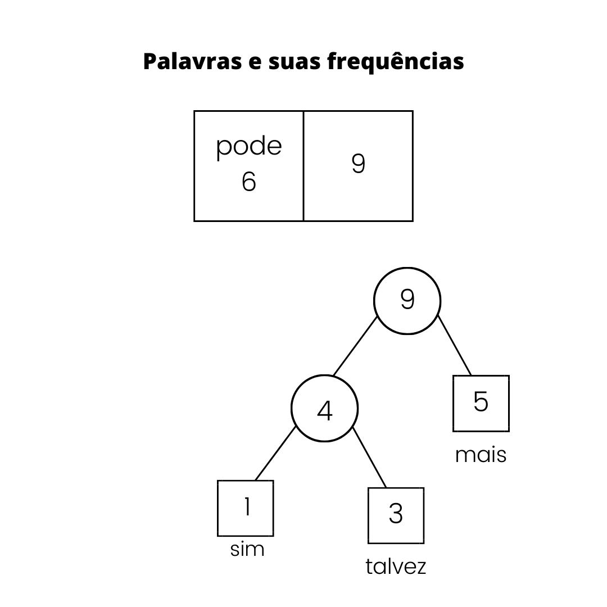 |
| 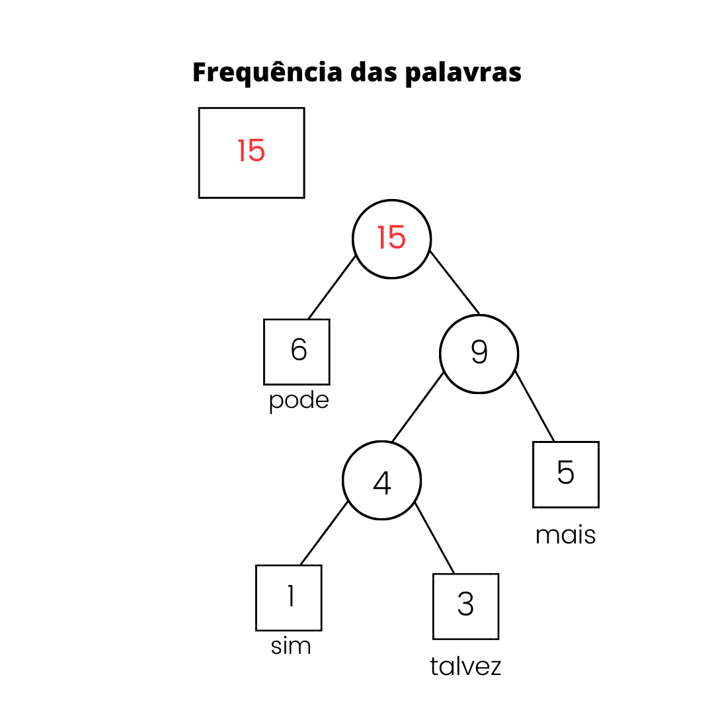 | 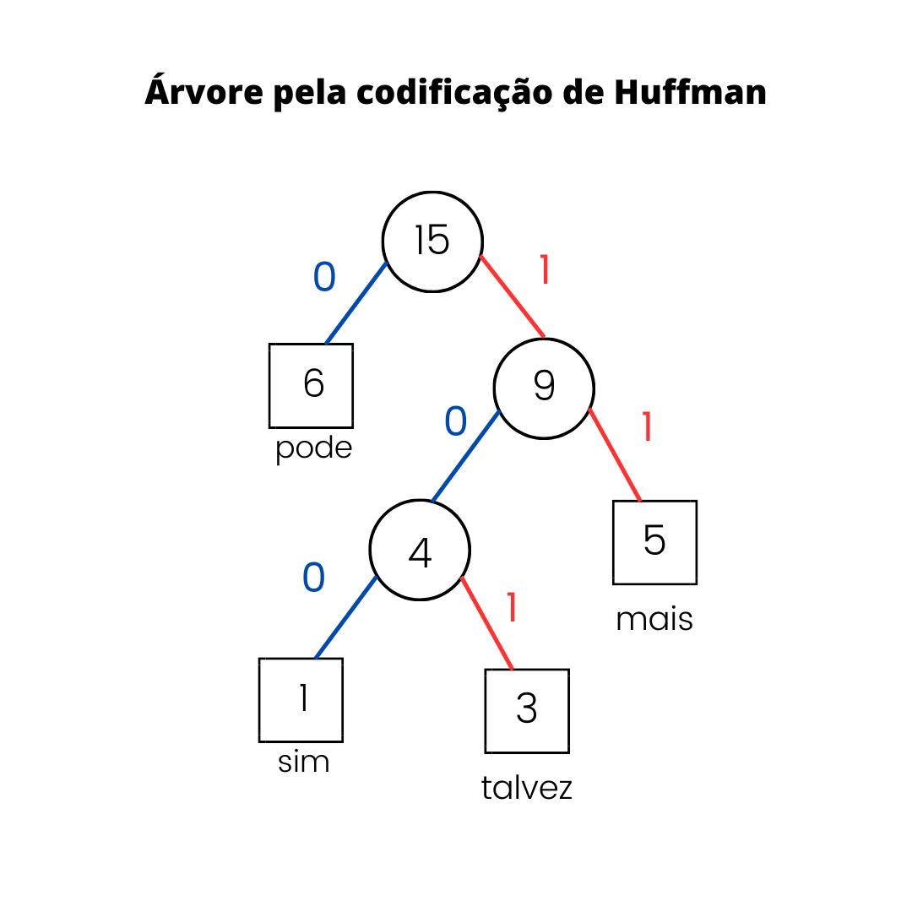 |


## 💻Comparação entre algoritmos

As árvores de busca binária podem ser bem aplicadas em algoritmos de ordenação, ou ainda quando os dados têm uma hierarquia natural, podem ser usadas para representar essa hierarquia de forma eficiente e ainda como estruturas de dados que implementam dicionários (tabelas de hash) podem usar a aŕvore binária para manter as chaves em ordem, permitindo a busca eficiente de chaves próximas.
Porém, a falta de equilíbrio é uma desvantagem para as árvores binárias, pois no pior caso, a altura da árvore pode ser O(n), resultando em complexidade de tempo de O(n) para as operações. <br> 
Pois a estrutura pode vir a ficar cada vez mais profunda, trazendo perca de desempenho.  

No entanto, o processo de balanceamento pode ser custoso em termos de desempenho, como na estrutura AVL, envolve a atualização de ponteiros e valores em diferentes partes da árvore. Exigindo mais operações de rotação e ajuste para cada novo nó inserido ou removido.<br>
Aplicações práticas das árvores AVL incluem e sistemas onde a eficiência na manipulação de dados é crucial para o desempenho. Essas árvores garantem a estabilidade da estrutura, tornando-as valiosas em cenários onde o equilíbrio é fundamental para o desempenho geral do sistema. Pórem para grande volume de dados, manter o custo das rotações e de mais elementos para montar a estrutura, a AVL se torna menos viável de ser utilizada.

Entretanto, a frequência de uma determinada informação em um grupo de dados pode ser revelante, no caso da codificação de Huffman, por exemplo, em ASCII, cada código de caractere ocupa exatamente 8 bits. Na prática, nem todos os caracteres ocorrem com a mesma frequência. A codificação Huffman tira vantagem disso e atribui códigos menores para caracteres mais frequentes, em detrimento da atribuição de códigos maiores para caracteres menos frequentes. Ainda, nessa codificação não existe outra palavra de código que seja um prefixo de outra palavra de código válida. Torando-se uma implementação útil para Compactação de arquivos e Transmissão de dados pela Internet, pois cada código é exclusivo para cada dado.

 ## 🕜Tempo de execução 

A contagem foi feita pelas ferramentas disponibilizadas pela bibioteca "time.h". <br/>
O algoritmo foi executado 10 vezes e obteve-se como média geral o tempo de: $      $ $ms$

## ✅Resultados 

No terminal é mostrado apenas o tempo de execução.
A saída completa do programa está no arquivo ```output.txt``` que contém:
Para cada texto, se a palavra aparecer é mostrado:
- Sua frequência, árvore binária e avl que mostram a palavra e sua ocorrência e a codificação de huffman que mostra a palavra e seu código, correspondente a esse texto.
Se a palavra não estiver no texto, nada sobre ela será mostrado no output.


##  📋Conclusão 

Este projeto permitiu a exploração e implementação de diferentes estruturas de dados e algoritmos em um contexto prático. Foi possível observar as vantagens e desvantagens de cada uma dessas estruturas e algoritmos em relação à tarefa de autocompletar e oferecer sugestões de palavras aos usuários.
As árvores binárias demonstraram ser eficazes para a busca e organização de palavras, mas sua falta de balanceamento pode levar a um desempenho inferior em casos extremos. A árvore AVL, por outro lado, garante um equilíbrio automático, tornando-a uma escolha sólida quando a estabilidade da estrutura é crucial.
A codificação de Huffman mostrou ser uma técnica poderosa para otimizar a representação de palavras com base em sua frequência, economizando espaço e sendo útil em cenários de compactação de dados.
Em termos de tempo de execução, os algoritmos apresentaram desempenho variado, com a árvore AVL e a codificação de Huffman oferecendo tempos de execução mais eficientes em comparação com a árvore binária não balanceada.


##  👾Compilação e Execução  

Esse pequeno exemplo possui um arquivo Makefile que realiza todo o procedimento de compilação e execução. <br/>Para tanto, temos as seguintes diretrizes de execução:


| Comando                |  Função                                                                                           |                     
| -----------------------| ------------------------------------------------------------------------------------------------- |
|  `make clean`          | Apaga a última compilação realizada contida na pasta build                                        |
|  `make`                | Executa a compilação do programa utilizando o gcc, e o resultado vai para a pasta build           |
|  `make run`            | Executa o programa da pasta build após a realização da compilação                                 |

## Referências 

https://www.geeksforgeeks.org/insertion-in-an-avl-tree/ <br>
https://www.geeksforgeeks.org/huffman-coding-using-priority-queue/ <br>
https://www.geeksforgeeks.org/applications-advantages-and-disadvantages-of-binary-search-tree/ <br>
https://www.geeksforgeeks.org/insertion-in-an-avl-tree/ <br>

### Contato 
<div>
 <br><p align="justify"> Anna Laura Moura Santana</p>
 <a href="https://t.me/annalaurams">
  
 </div>
<a style="color:black" href="mailto:nalauramoura@gmail.com?subject=[GitHub]%20Source%20Dynamic%20Lists">
✉️ <i>nalauramoura@gmail.com</i>
</a>
