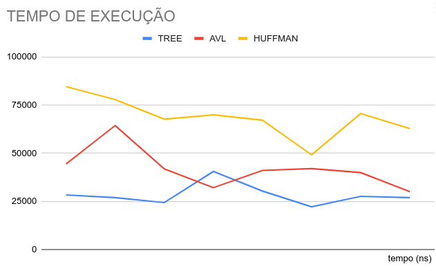
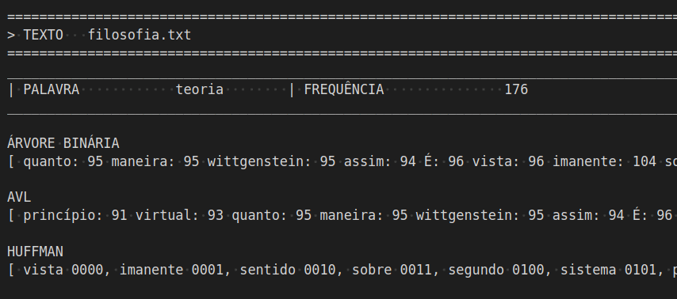

# **Sistema de Autocompletar e Sugestões de Palavras**

Atividade para a disciplina de Algoritmos e Estruturas de Dados II. <br/>

## 🎯Objetivo 

O projeto foi desenvolvido na linguagem de programação ```C++```.
<br>
O objetivo principal é estabelecer uma relação entre as palavras presentes nos textos, considerando a frequência com que ocorrem, e as palavras que os utilizadores estão a pesquisar.
<br>A base desse algoritmo segue o trabalho realizado anteriormente e pode ser acessado em  <a href="https://github.com/annalaurams/Top-K-Elementos.git">Top K elementos</a> sendo este continuação do anterior.

No âmbito deste projeto, o objetivo consiste em desenvolver um sistema capaz de fornecer funcionalidades de autocompletar e sugestões de palavras aos utilizadores. Para tal, baseamo-nos na estrutura de uma árvore binária comum como alicerce. Além disso, implementamos uma árvore AVL e o algoritmo de Huffman com o intuito de realizar comparações de desempenho.
<br>

## 🗂️Estrutura 

- Dentro da pasta ```src``` contém a pasta ```include``` com os arquivos ```.hpp```:

- ```document.hpp:``` Inclusão de bibliotecas e definição da variável ```K```.
- ```shared.hpp:```  Contém a struct ```WordInfo```..
- ```tree.hpp:``` Contém a struct ```No```.
- ```avl.hpp:```  Contém a struct ```AVL```.
- ```huffman.hpp:```  Contém a struct ```Huffman```.

De fora da pasta ```include```contém os arquivos ```.cpp```

- ```document.cpp:``` Desenvolvimento das funções de leitura e manipulação dos arquivos de entrada.    
- ```tree.cpp:```  Funções relacionadas a árvore binária comum.
- ```avl.cpp:```  Funções relacionadas a árvore avl.  
- ```huffman.cpp:```  Funções relacionadas a codificação de huffman.  
- ```heap.cpp:```  Implementação do heap.  
- ```main.cpp:``` Chamada das funções usadas e o tempo de execução do programa.

- Dentro da pasta ```data```contém os arquivos:

- ```input.txt:``` Palavras de busca. 
- ```stopwords.txt:``` Artigos e conjunções como (a, o, as, os, e, ou).
- ```output.txt``` Arquivo de saída. 

- Outros arquivos contidos dentro da pasta ```data```se referem aos textos de entrada.

## 📝Decisões de implementação  

As especificações a seguir foram propostas para discussão do problema:

 
- Os textos de entrada são lidos independente do nome, desde que estejam na pasta ```data``` e os nomes são armazenados em uma ```list<string>nameFiles```.
- Inicialmente o algoritmo percorre a lista com o nome dos arquivos, e para cada texto que é aberto, os seguintes procedimentos ocorrem:

- O algoritmo realiza a leitura dele e cria uma tabela de dispersão (hash) intitulada ```glossary```, para contar quantas vezes cada palavra aparece no texto. A chave do hash é a própria palavra e o valor são as ocorrências, armazenadas em uma struct denominada ```WordInfo```.

- Após isso, outro looping inicia para a lista de palavras a serem buscadas, para cada palavra do input os seguintes procedimentos ocorrem:
  1. É verificado se a palavra está no texto, se não estiver ela é ignorada e é processado a próxima palavra.
<br>  
Se estiver, o próximo comando será:

- A partir de um tamanho K, é criado um vetor intitulado ```heap```  que armazena as K palavras mais ocorrentes do texto.

Em seguida:

  2. É verificado se a palavra está no heap, se sim, ela é retirada dele. Se não, o elemento de menor ocorrência do heap é tirado.
  3. É criada a árvore binária.
  4. É criada a árvore AVL.
  5. É criada a árvore a partir do código de Huffman.

As árvores criadas terão a mesma quantidade de elementos que o valor de ```K```e cada nó é uma posição do heap.

- Depois desses passos, todas as árvores e o heap são excluídos.
- É processada a próxima palavra, e o procedimento se repete até que todos os inputs sejam processados.
- Após isso  o glossário é limpado e é lido o próximo texto, repetindo os mesmos passos até que todos sejam lidos.
- Quando todos forem lidos, o algoritmo finaliza o output e encerra o programa.

De modo geral, para cada texto é buscado uma lista de palavras e para cada uma presente no texto, ela terá 3 tipos de estruturas em árvore.

- Os textos de entrada são lidos caracter por caracter, e utiliza-se um switch case para identificar o início e o fim das palavras.
- As palavras que contém hífen, tiveram o hífen removido. Por exemplo "arco-íris" passa a ser "arcoíris".
- O valor da variável ```K```pode ser alterado, porém sempre deve ser um valor com uma unidade a mais do que se deseja mostrar <br>
  exemplo: Para um heap de tamanho 20, o valor de K deverá ser 21.

- A principal função do código denominada ```search```, inclusa do arquivo ```document.cpp``` é a responsável por organizar todas as etapas mencionadas, garantindo que a ordem de chamada das funções e o looping mantenham o funcionamento do algoritmo.

- A saída completa do programa está no arquivo ```output.txt``` que será criado ao longo da execução, nele contém:<br>
- Texto analisado
- Palavra com sua frequência naquele texto
- Árvore binária e avl que mostram a palavra e sua ocorrência e a codificação de huffman que mostra a palavra e seu código, correspondente a esse texto.
Se a palavra não estiver no texto, nada sobre ela será mostrado no output.
- As 3 estruturas mencionadas são impressas no formato "pós ordem".

## 💻Metodologia  
### Árvore Binária Comum

Uma árvore binária é uma estrutura de dados hierárquica composta por nós, em que cada nó pode ter, no máximo, dois filhos: um filho à esquerda e um filho à direita. <br>
Cada nó de uma árvore binária consiste em três partes:

1. Dados: Armazena as informações associadas ao nó, nessa caso uma struct ```WordInfo```com a palavra e a ocorrência.
1. Ponteiro para o filho esquerdo.
1. Ponteiro para o filho direito.

- A regra para inserção é: Dado um nó, se o valor a ser inserido for menor ou igual ao nó, o item irá para a esquerda e se for um valor maior que o nó o item vai para direita. Esse processo inicia pela raiz, desde que ela exista. Se não o elemento se torna a raiz.

- Neste caso, quando o valor for igual a um já inserido na árvore, esse novo será inserido a esquerda do nó.

Custo Computacional: $O$ $(n)$
#### Exemplo da inserção deste método 
<br>

<div style="display: flex; justify-content: center;">
    
</div>


### AVL (Árvore Adelson-Velsky e Landis)

A árvore AVL é uma árvore de pesquisa binária aproximadamente balanceada. <br>
A regra de inserção é a mesma que na binária comum, porém  as diferenças entre as alturas das subárvores esquerda e direita é no máximo 1.<br>
Esse equilíbrio é mantido por meio de ```rotações```, podendo elas serem simples ou duplas. As duplas nada mais são que duas simples seguidas.<br>
Sua estrutura contém o dado, ponteiros para esquerda e direita assim como na estrutura anterior, com o acrécimo de uma váriavel ```fator de balanceamento ```em cada nó.

- Neste caso, quando o valor for igual a um já inserido na árvore, este valor será inserido a esquerda do nó.

Para cada nó é calculado a distância dele até seu último nó (folha) e verifica-se a diferença de altura entre as subárvores.<br>
Para tal, utiliza-se o  ```fator de balanceamento```de cada nó.<br>
A árvore está balanceada se o fator de equilíbrio em cada nó estiver entre -1 e 1, se não, ela estará desequilibrada e é necessário fazer o balanceamento.

Ao identificar o desbalanceamento na:

- Subárvore da direita do filho da direita do nó, ```rotação simples à esquerda```.
- Subárvore da esquerda do filho da direita do nó, ```rotação dupla à esquerda```.  
- Subárvore da direita do filho da esquerda do nó, ```rotação dupla à direita```.
- Subárvore da esquerda do filho da esquerda do nó, ```rotação simples à direita```.

Custo Computacional: $O$ $log$ $(n)$ onde $n$ é o número de nós na árvore.

#### Exemplo da inserção deste método, com rotação dupla

|           |           |
| --------- | --------- |
|  |  |
Ao inserir o próximo elemento, o ```7``` percebe-se que ficará desequilibrada.
|  |  |
|  |  |

Ocorreu rotação dupla, primeiro uma simples à esquerda e depois uma simples à direita. <br>
O nó $6$ que anteriormente era pai do $7$, se tornou filho esquerdo dele.


### Codificação de Huffman

O algoritmo de codificação de Huffman é um método de compressão de dados que é amplamente utilizado na compactação de informações. É útil para compactar os dados nos quais há caracteres (palavras) que ocorrem com frequência. Foi desenvolvido pela primeira vez por David Huffman.<br>
Dado o heap, a tarefa é encontrar códigos Huffman para cada palavra. Funciona da seguinte maneira:

1. Os dados são organizados em ordem crescente de frequência e armazenados em uma fila de prioridade.
2. Cria-se um nó vazio ```x```. A primeira frequência mínima se torna filho esquerdo de x e a segunda frequência mínima o filho direito de x. <br>
  O valor de x será a soma das duas frequências mínimas que se tornaram seus filhos.
3. Essas duas ocorrências utilizadas são removidas da fila, e x é adicionada de volta na fila, troca-se dois nós por um único.
4. O processo se repete até que reste apenas um elemento na fila.
5. Por fim, se tem a árvore montada.
6. Para os nós filhos a esquerda é atribuído o valor ```0```.
7. Para os nós filhos a direita é atribuído o valor ```1```.

- Cada palavra terá um código formado por 0 e/ou 1.
- Para decodificar o código, deve-se percorrer a árvore seguindo os bits no código até chegar a uma folha, que corresponde a um elemento do conjunto de dados original.

Complexidade de tempo: $O$ $($ $n*log$ $n$ $)$ onde $n$ é o número de caracteres únicos <br>
Espaço Auxiliar: $O$ $(n)$

#### Exemplo da inserção deste método

|           |           |
| --------- | --------- |
|  |  |

Acima, foi somado o $1$ $+$ $3$, resultando em um novo nó de valor $4$
<br>
nó com frequência $1$ se tornou filho esquerdo e o nó com frequência $3$ se tornou filho direito de $4$
<br>
$4$ foi inserido de volta na fila

|  |  |

O procedimento mencionado anteriormente se repete até restar 1 elemento na fila, neste caso o nó de valor $15$.
Atribuindo os $0$ e $1$, obtem-se a árvore.<br>
Por exemplo, o código da palavra "talvez" será "101"


## 💻Comparação entre algoritmos

As árvores de busca binária podem ser bem aplicada em algoritmos de ordenação por exemplo, ou ainda usadas para representar uma hierarquia de forma eficiente e ainda serem uilizadas como estruturas de dados que implementam dicionários (tabela hash) para manter as chaves em ordem, permitindo a busca eficiente de chaves próximas. <br>
Porém, a falta de equilíbrio é uma desvantagem para as árvores binárias, pois no pior caso, a altura da árvore pode ser $O(n)$, resultando em complexidade de tempo de $O(n)$ para as operações. Pois ela se torna cada vez mais profunda.
<br>
No entanto, o processo de balanceamento pode ser custoso. Na estrutura AVL, envolve a atualização de ponteiros e valores em diferentes partes da árvore. Exigindo mais operações de rotação e ajuste para cada novo nó inserido ou removido.<br>
Porém, essas árvores garantem a estabilidade aproximada da estrutura, tornando-as valiosas em cenários onde o equilíbrio é fundamental para o desempenho geral do sistema. Pórem para grande volume de dados, manter o custo das rotações e de mais elementos para montar a estrutura, torna a AVL menos viável de ser utilizada.
<br>
Entretanto, a frequência de uma determinada informação em um grupo de dados pode ser revelante, no caso da codificação de Huffman, por exemplo. Na prática, nem todos as palavras ocorrem com a mesma frequência.<br> 
A codificação Huffman tira vantagem disso e atribui códigos menores para strings mais frequentes, em detrimento da atribuição de códigos maiores para as menos frequentes. Torando-se uma implementação útil para Compactação de arquivos e Transmissão de dados pela Internet, pois cada código é exclusivo para cada dado.
<br> 
- Se tratando de tempo de execução, a diferença entre os algoritmos pode ser mostrada pelo gráfico abaixo, que marca o tempo de construção da estrutura, escrita no output e exclusão da mesma, medido em nanossegundos.<br> 
Para este teste, foi feito a construção para um texto, no caso, o texto ```filosofia```, buscando 8 palavras, contidas no input disponibilizado.
<br> 
<div style="display: flex; justify-content: center;">
    
</div>

- A diferença é significamente pequena, mas para uma grande entrada de dados, algumas especificidades da estrutura podem ser determinantes no desempenho do programa.
<br>

 ## 🕜Tempo de execução 

A contagem foi feita pelas ferramentas disponibilizadas pela bibioteca ```chrono```. <br/>
O algoritmo foi executado 10 vezes e obteve-se como média geral o tempo de: $435,4$ $ms$

## ✅Resultados 

Utilizando K = 20 e os arquivos disponibilizados nesse git:

Heap:

<div style="display: flex; justify-content: center;">
    
</div>

Exemplo de um trecho output (não contém todas as K palavras na imagem):


<div style="display: flex; justify-content: center;">
    
</div>

No terminal é mostrado apenas o tempo de execução total do programa.<br>


##  📋Conclusão 

Este projeto permitiu a exploração e implementação de diferentes estruturas de dados e algoritmos em um contexto prático. Foi possível observar as vantagens e desvantagens de cada uma desses algoritmos em relação à tarefa de autocompletar e oferecer sugestões de palavras aos usuários.
Em termos de tempo de execução, os algoritmos apresentaram desempenho variado, com a árvore binária comum sendo um pouco mais rápida do que as duas outras estruturas, neste contexto.

##  👾Compilação e Execução  

Esse pequeno exemplo possui um arquivo Makefile que realiza todo o procedimento de compilação e execução. <br/>Para tanto, temos as seguintes diretrizes de execução:


| Comando                |  Função                                                                                           |                     
| -----------------------| ------------------------------------------------------------------------------------------------- |
|  `make clean`          | Apaga a última compilação realizada contida na pasta build                                        |
|  `make`                | Executa a compilação do programa utilizando o gcc, e o resultado vai para a pasta build           |
|  `make run`            | Executa o programa da pasta build após a realização da compilação                                 |

### Contato 
<div>
 <br><p align="justify"> Anna Laura Moura Santana</p>
 <a href="https://t.me/annalaurams">
  
 </div>
<a style="color:black" href="mailto:nalauramoura@gmail.com?subject=[GitHub]%20Source%20Dynamic%20Lists">
✉️ <i>nalauramoura@gmail.com</i>
</a>
